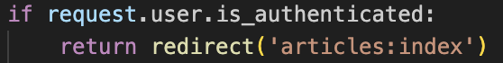

# Debug Test

## accounts

> 회원가입시 바로 로그인 되게 하는법

> 로그인 되어있으면 로그인 페이지 못가게 하기

> profile

> follow

> urls.py

> models.py

> forms.py

> admin.py

> profile.html

## articles

> 폼에 없는 필드 함께 저장할때 (create)

> likes

> comment_delete

> urls.py

> models.py

> forms.py

> index.html

> detail.html

## project dir

> settings.py

> urls.py

> static 이미지 업로드

> 사용자에게 이미지 업로드 받아서 media에 저장

